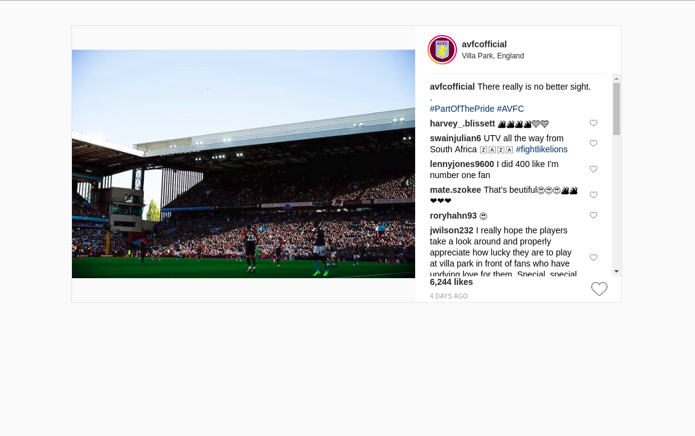

# Student Beans Frontend Task

## Task

Complete this React app that recreates the above mockup. At a minimum your solution should:

* Use the existing component structure to organise your code
* Use Standard.js to lint your code
* Look as visually as close to the mockup as possible

Beyond this feel free to improve or extend the app as you see fit

## Running the app

1. Run `docker-compose up`
2. That's it. The app will be running on port `3000` of your docker machine. 